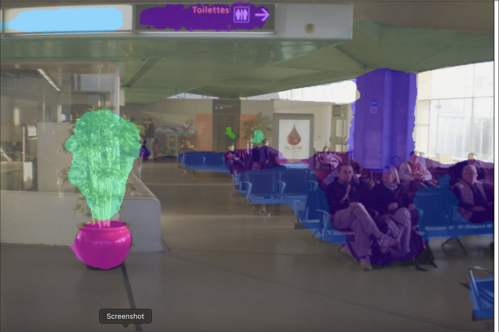

# Fine-Tune SegFormer

This repository contains the code, original images, segmentation results, and instructions for fine-tuning the image segmentation model on custom datasets.

## Repository Structure


## Getting Started

### Prerequisites

- Python 3.x
- Required libraries listed in `requirements.txt`

To install dependencies, run:

```bash
pip install -r requirements.txt
```
#Running the Fine-Tuning Script

##To fine-tune the model, use the following command:
```bash
python finetune.py
```


<table> <tr> <th>Original Image</th> <th>Segmentation Result</th> </tr> <tr> <td></td> <td></td> </tr> <tr> <td></td></tr> </table>
